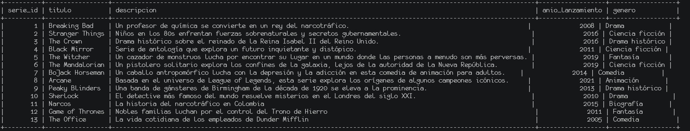
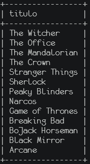
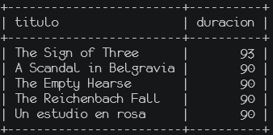
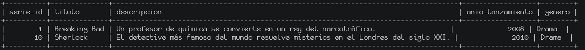
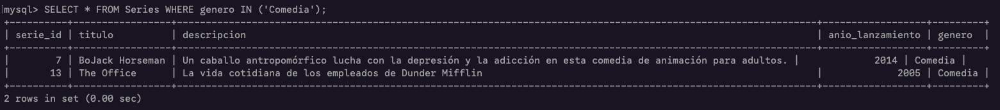
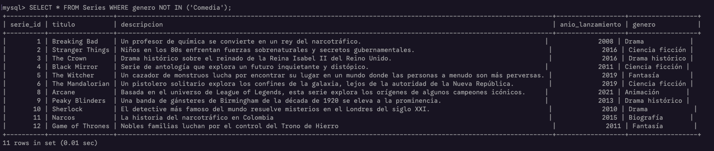
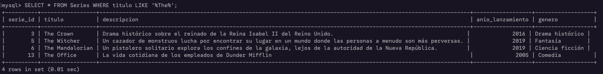
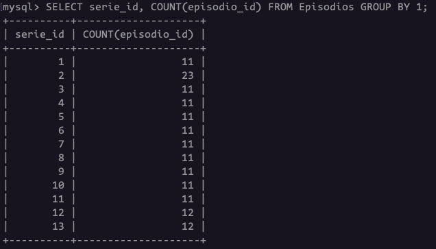
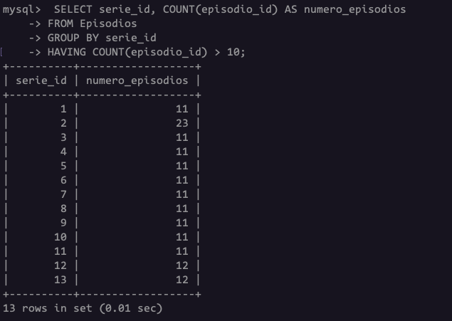

# Consultas

## SELECT

SELECT es la instrucción fundamental para consultar/recuperar datos de una base de datos.

**Syntaxis**

`SELECT column1, column2, ... FROM <table_name>`

**Ejemplo**

Obtener todos los Episodios de Series:

`SELECT * FROM Series;`

<p align="center">
  
</p>

### Ejercicios 1 - 5

## DISTINCT

Es una claúsula que se utiliza para eliminar duplicados de los resultados de una consulta, mostrando unicamente valores unicos.

**Sintaxis**

`SELECT DISTINCT column1, column2, ... FROM <table_name>`

**Ejemplo**

Obtener los generos de las Series:

`SELECT DISTINCT genero FROM Series;`

<p align="center">
  
</p>

### Ejercicios 6 - 10

## ORDER BY

Utilizado para ordenar los resultados de una consulta en orden ascendente (ASC) o descendente (DESC).

**Sintaxis**

`SELECT column1, column2, ... FROM <table_name> ORDER BY column1 [ASC, DESC], column2 [ASC, DESC], ...;`

**Ejemplo**

Obtener los titulos de las serires ordenados de forma descendente:

`SELECT titulo FROM Series ORDER BY titulo DESC;`

<p align="center">
  
</p>

### Ejercicios 11 - 15

## LIMIT

Utilizado para restringir la cantidad de filas que devuelve una consulta, es sumanet útil cuando solament se necesita ver un número específico de resultados.

**Sintaxis**

`SELECT column1, column2, ... FROM <table_name> LIMIT n;`

**Ejemplo**

Se hace un limit de los 5 episodios conmayir duración

`SELECT titulo, duracion FROM Episodios ORDER BY duracion DESC LIMIT 5;`

<p align="center">
  
</p>

### Ejercicios 16 - 20

## WHERE

Utilizado para filtrar registros en una consulta, ya que permite especificar condiciones para que la base de datos devuelva solo las filas que cumplan ciertos criterios.

**Sintaxis**

`SELECT column1, column2, ... FROM <table_name> WHERE column (=,<,>,>=,<=,<> o !=) 'condition';`

**Ejemplo**

Todas las series donde su genero sea drama

`SELECT * FROM Series WHERE genero='Drama'`

<p align="center">
  
</p>

Todas las series donde el año de lanzamiento sea mayor a 2010

`SELECT * FROM Series WHERE anio_lanzamiento > 2010;`

<p align="center">
  
</p>

### Ejercicios 21 - 25

## Operadores lógicos y operadores de comparación

Son utilizados para tener condiciones en las consultas, los oepradores de comparación se utilizan para comparar valores entre columnas o con valores específicos, los operadores lógicos se utilizan para combiarn varias condiciones.

| Operador |              Significado              |              Ejemplo               |
| :------: | :-----------------------------------: | :--------------------------------: |
|    =     |                Igual a                |            precio = 100            |
| <> o !=  |             Diferente de              |           precio <> 100            |
|    >     |               Mayor que               |             edad > 18              |
|    <     |               Menor que               |             edad < 18              |
|    >=    |            Mayor igual que            |          salario >= 2000           |
|    <=    |            Menor igual que            |          salario <= 2000           |
|   AND    | todas las condiciones deben cumplirse |   edad > 18 AND pais = 'Mexico'    |
|    OR    | al menos una condición debe cumplirse | pais = 'Mexico' OR pais = 'España' |
|   NOT    |          Niega la condición           |           NOT edad = 18            |
| BETWEEN  |     Busca valores entre un rango      |        BETWEEN 100 AND 500         |

### Ejercicios 26 - 30

## IN

Se utiliza para comparar un valor con una lista de valores dentro de una condición, generalmente en la claúsula WHERE.

**Sintaxis**.

`SELECT column1, column2, ... FROM <table_name> WHERE column IN (value1, value2, ...);`

**Ejemplo**.

Todos los generos de las series que sean genero de comedia.

`SELECT * FROM Series WHERE genero IN ('Comedia');`

<p align="center">
  
</p>

## NOT IN

Utilizado para excluir valores de una lista.

**Sintaxis**

`SELECT column1, column2, ... FROM <table_name> WHERE column NOT IN (value1, value2, ...);`

**Ejemplo**

Todo los generos que no sean comedia

`SELECT * FROM Series WHERE genero NOT IN ('Comedia');`

<p align="center">
  
</p>

También se puede utilizar IN en subconsultas:

```sql
SELECT * FROM pedidos WHERE cliente_id IN (
  SELECT id
  FROM clientes
  WHERE pais = 'México'
)
```

### Ejercicios 31 - 35

## LIKE

Se utiliza para buscar patrones dentro de texto, este es muy útil cuando no necesitas una coincidencia exacta, sino algo "parecido".

**Sintaxis**

`SELECT column1, column2, ... FROM <table_name> WHERE column LIKE 'pattern';`

Los comodines (pattern) son los siguientes:

- `%`(porcentaje): representa cualquier cantidad de caracteres 0, 1 o más

```sql
WHERE nombre LIKE 'A%' -- comienza con "A"

WHERE nombre LIKE '%A' -- termina con "A"

WHERE nombre LIKE '%A%' -- contiene "A" en cualquier posición
```

- `_` (guion bajo): representa un solo carácter

```sql
WHERE nombre LIKE 'AB_%' --empieza con "AB", seguido de al menos u carácter

WHERE nombre LIKE '_a%' -- segunda letra es "a"
```

Algunos comodines adicionales son los siguientes:

- `[abc]`: un carácter especifico de la lista - `'[JP]uan'`
- `[a-z]`: rango de caracteres - '`[A-Z]%`'
- `[^abc]`: cualquier carácter excepto los indicados - `'[^A]%'`

**Ejemplo**

Se tienen toda las series que contengan 'The' en el titulo

`SELECT * FROM Series WHERE titulo LIKE '%The%';`

<p align="center">
  
</p>

### Ejercicios 36 - 40

## FUNCIONES DE AGREGADO

Son funciones que toman múltiples filas y devuelven un solo valor.  
Las funciones son:

- COUNT(): cuenta filas
- SUM(): suma valores
- AVG(): promedio
- MIN(): mínimo
- MAX(): máximo
- STDDEV() / STDDEV_POP(): desviación estándar
- STDDEV_SAMP(): desviación estándar muestral
- VARIANCE() / VAR_POP(): varianza
- VAR_SAMP(): varianza muestral
- SUM(DISTINCT col): suma valores únicos
- AVG(DISTINCT col): promedio de únicos
- STRING_AGG(): concatena strings solamente se puede utilizar con PostgreSQL, SQL Server
- GROUP_CONCAT(): concatena strings solamente se puede utilizar con MySQL
- LISTAGG(): concatena strings solamente se puede utilizar con Oracle
- PERCENTILE_COUNT(): conteo de percentil PostgreSQL, Oracle
- PERCENTILE_DISC(): PostgreSQL, Oracle
- MEDIAN(): calculo de la mediana Oracle

Las funciones de agregación se pueden utilizar de las siguientes maneras:  
**Directamente en el select**

1. `SELECT COUNT(*) FROM <table_name>;`
   - COUNT(\*) -> cuenta todo incluyendo lo valores NULL
   - COUNT(column) -> cuenta todo el contenido de la columna ignorando los NULl

2. `SELECT SUM(column) FROM <table_name>:`
   - solo funciona con números
   - ignora NULL

**Con el GROUP BY**

Sin GROUP BY agregas toda la tabla, con GROUP BY agregas por grupos.

`SELECT column, COUNT(*) FROM <table_name> GROUP BY column;`

**Con WHERE Y HAVING**

Con WHERE se filtra las filas antes de agrupar y con HAVING se filtran resultados después de agrupar.

## GROUP BY

Srive para agrupar filas que comparten valores en una o más columnas, con el objetivo de aplicar funciones de agregación sobre cada grupo, es decir, divide la tabla en bloques y luego resume cada bloque.

**Sintaxis**

`SELECT column1, column2, ..., AGG_FUNC(column) FROM <table_name> GROUP BY column;`

La forma de funcionar de esta claúsula es la siguiente: lee todas las filas, agrupa por las columnas indicadas, aplica funciones de agregación por grupo, devuelve una fila por grupo.

**Ejemplo**

`SELECT serie_id, COUNT(episodio_id) FROM Episodios GROUP BY 1;`

<p align="center">
  
</p>

### Ejercicios 41 - 45

## HAVING

Utilizado para filtrar resultados después de aplicar `GROUP BY`, especialmente cuando hay funciones de agregación, es decir, esto filtra grupos no filas.

**Sintaxis**

```sql
SELECT column1, column2, ..., AGG_FUN(column)
FROM <table_name>
GROUP BY column
HAVING condition;
```

**Ejemplo**

Series que tienen más de diez episodios en total.

```sql
SELECT serie_id, COUNT(episodio_id) AS numero_episodios
FROM Episodios
GROUP BY serie_id
HAVING COUNT(episodio_id) > 10;
```

<p align="center">
  
</p>

Existe una diferencia entre la cláusula `WHERE` y `HAVING`, uno filtra datos crudos y el otro filtra datos ya resumidos.

| Cláusula | Cuando se ejecuta  | Que filtra | Usa agregaciones |
| :------: | :----------------: | :--------: | :--------------: |
| `WHERE`  |  Antes de agrupar  |   Filas    |        NO        |
| `HAVING` | Despúes de agrupar |   Grupos   |        SI        |

**Ejemplo**

`WHERE`: elimina juegos con costo menor a 50

```sql
SELECT *
FROM juegos
where precio > 50;
```

`HAVING`: eliminar generos de videojuegos con poco juegos

```sql
SELECT genero, COUNT(*)
FROM juegos
GROUP BY genero
HAVING COUNT(*) > 5;
```

Combinando las dos cláusulas: obtener el promedio de los precios de los videojuegos por genero, que sean mayor a 20 el promedio

```sql
SELECT genero, AVG(precio)
FROM juegos
WHERE precio > 0
GROUP BY genero
HAVING AVG(precio) >20;
```

En resumen si no hay agregación se utiliza `WHERE`, si hay agregación se utiliza `HAVING`

### Ejercicios 46 - 50
