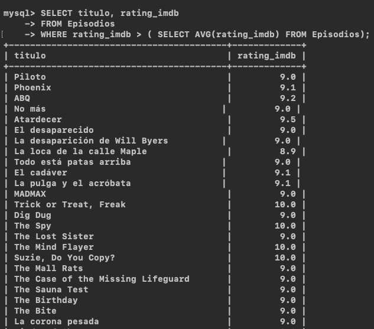
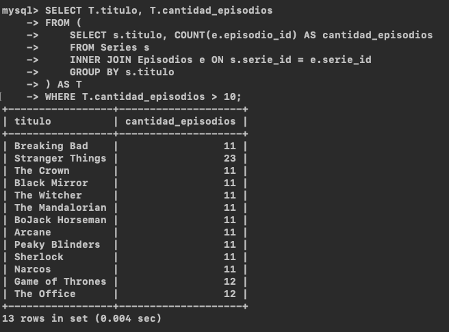
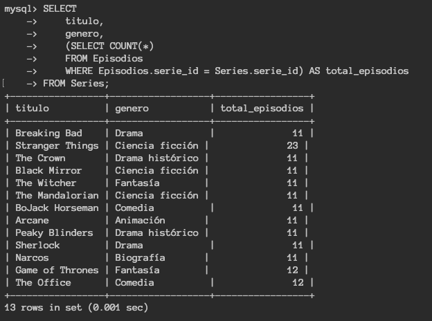
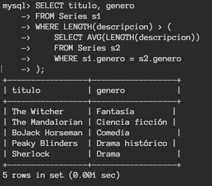
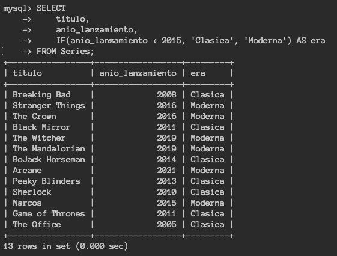
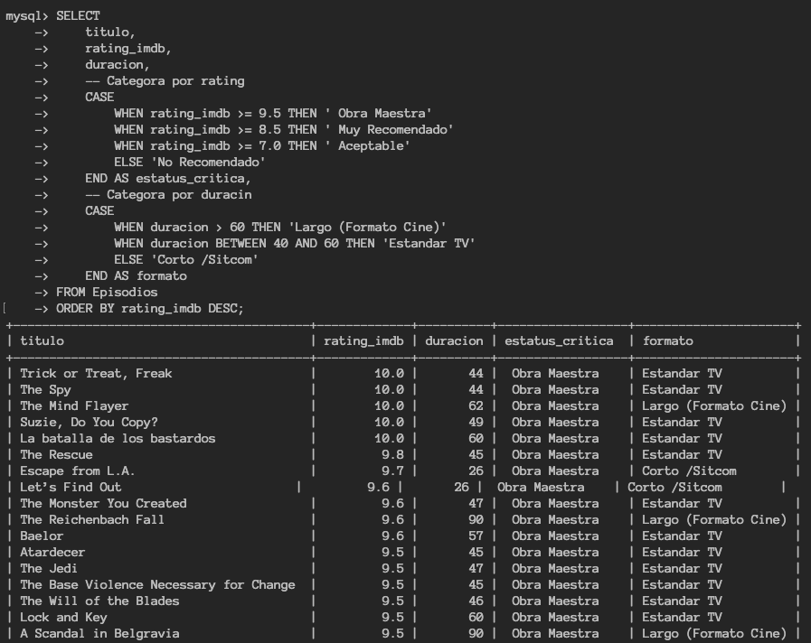

# Consultas intermedio

## Subconsulta

También conocida como Inner Query es una consulta dentro de otra consulta. Se utilizan para realizar operaciones que requieren dos pasos: primero obtener un dato o conjunto de datos y luego usar ese resultado para filtrar o calcular la consulta principal.

Las subconsultas simpre van encerradas entre paréntesis `()` y dependiendo de lo que necesites, se pueden ubicar en diferentes cláusulas.

### `WHERE` (filtrado dinámico): permite filtrar registros basados enun valor que no se conoce

**Ejemplo**

Obtener los episodios que tienen un rating mayor al promedio de toda las base de datos:

```sql
SELECT titulo, rating_imdb
FROM Episodios
WHERE rating_imdb > (SELECT avg(rating_imdb) FROM Episodios);
```

<p align="center">
  
</p>

### `FROM` (tabla temporal): Aqui la subconsulta actúa como una tabla virtual a la que le puedes dar un alias.

**Ejemplo**  
Se quiere saber cuántos episodios tiene cada serie y filtrar solo las que tienen más de 10:

```sql
SELECT T.titulo, T.cantidad_episodios
FROM (
    SELECT s.titulo, COUNT(e.episodio_id) AS cantidad_episodios
    FROM Series s
    INNER JOIN Episodios e ON s.serie_id = e.serie_id
    GROUP BY s.titulo
) AS T
WHERE T.cantidad_episodios > 10;
```

<p align="center">
  
</p>

### `SELECT` (para cálculos fila por fila): Se usa para traer un dato específico relacionado con cada fila de la consulta principal.

**Ejemplo**

Mostrar una lista de todas las Series, pero al lado de cada nombre, queremos ver cuántos Episodios tiene registrados en total.

```sql
SELECT
    titulo,
    genero,
    (SELECT COUNT(*)
    FROM Episodios
    WHERE Episodios.serie_id = Series.serie_id) AS total_episodios
FROM Series;
```

<p align="center">
  
</p>

---

---

Dependiendo de qué devuelva la subconsulta, usarás operadosres distintos:

|  Tipo   |              Retorno               |          Operador común          |
| :-----: | :--------------------------------: | :------------------------------: |
| Escalar | Un único valor (1 fila, 1 columna) |           =, >, <, !=            |
|  Lista  |    Una columna con varias filas    |           IN, ANY, ALL           |
|  Tabla  |   Varias filas y varias columnas   | Se usa principalmente en el FROM |

---

---

Además las consultas pueden ser correlacionadas o no correlacionadas:

- **No correlacionadas:** La subconsulta es independiente, si se ejcuta aparte funciona correctamente.

- **Correlacionada:** La subconsulta hace referencia a una columna de lac onsulta principal, se ejecuta una vez por cada fila que procesa la consulta principal. Es más potente pero suele ser más lenta.

**Ejemplo**

Obtener las serires cuya descripción sea más larga que el promedio de las descripciones de su mismo género.

```sql
SELECT titulo, genero
FROM Series s1
WHERE LENGTH(descripcion) > (
    SELECT AVG(LENGTH(descripcion))
    FROM Series s2
    WHERE s1.genero = s2.genero
);
```

<p align="center">
  
</p>

---

---

En que momento se debe utilizar una subconsulta o un JOIN:

- Se usa `JOIN` cuando se necesite mostrar columnas de ambas tablas en el resultado final (es más eficiente en la mayoría de los motores)

- Se usa una subconsulta cuando solo necesites un dato para filtrar o cuando la lógica sea más fácil de leer de esa manera

## IF condicional

Cláusula que funciona solamente en MySQL, tiene la funcionalidad de realizar condiciones binarias Sí o No.

**Sintaxis**  
`IF(condición, valor_si_verdadero, valor_si_falso)`

**Ejemplo**  
Queremos saber rápidamente si una serie es antigua o nueva basada en su año de lanzamiento

```sql
SELECT
    titulo,
    anio_lanzamiento,
    IF(anio_lanzamiento < 2015, 'Clasica', 'Moderna') AS era
FROM Series;
```

<p align="center">
  
</p>

## CASE

Es la forma más común y es la forma más común de como funciona un "sí pasa esto, haz aquello"

**Sintaxis**

```sql
CASE
  WHEN <condición1> THEN <valor1>
  WHEN <condición2> THEN <valor2>
  WHEN <condición3> THEN <valor3>
  ...
  ELSE <valor_caso_contrario>
END AS <alias>
```

donde:

- `WHEN`: Evalúa la condición
- `THEN`: Es el resultado si la condición es verdadera
- `ELSE`: Es el valor por defecto si ninguna condición anterior se cumple

**Ejemplo**

Saber que episodios con Cortos o Largos y si su calificación en IMDb los posiciona como Populares.

```sql
SELECT
    titulo,
    rating_imdb,
    duracion,
    -- Categoría por rating
    CASE
        WHEN rating_imdb >= 9.5 THEN '⭐⭐⭐⭐⭐ Obra Maestra'
        WHEN rating_imdb >= 8.5 THEN '⭐⭐⭐⭐ Muy Recomendado'
        WHEN rating_imdb >= 7.0 THEN '⭐⭐⭐ Aceptable'
        ELSE 'No Recomendado'
    END AS estatus_critica,
    -- Categoría por duración
    CASE
        WHEN duracion > 60 THEN 'Largo (Formato Cine)'
        WHEN duracion BETWEEN 40 AND 60 THEN 'Estandar TV'
        ELSE 'Corto /Sitcom'
    END AS formato
FROM Episodios
ORDER BY rating_imdb DESC;
```

<p align="center">
  
</p>
