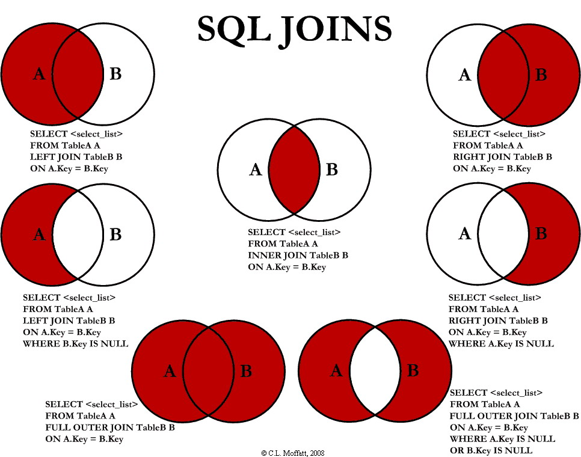
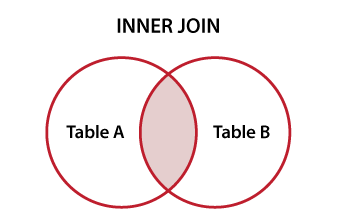
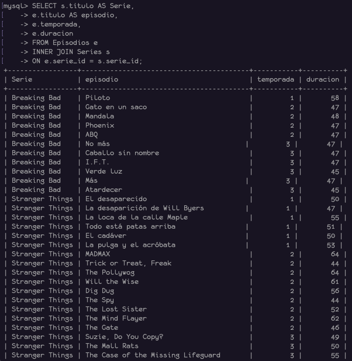
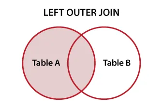
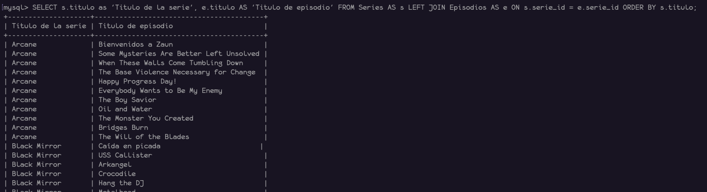
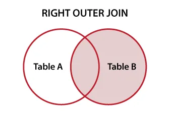
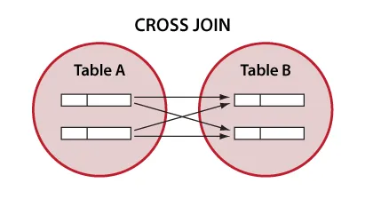

# Joins

Operación que permite combinar datos de dos o más tablas mediante una relación lógica entre ellas, generalmente usando clave primarias y foráneas, es decir, un join une tablas basándose en una columna común.

<p align="center">
  
</p>

## INNER JOIN

Se utiliza para combinar fila de dos o más tablas basándose en una condición común. Solo devuelve los registros que tienen coincidencia en ambas tablas, es decir, solamente muestra los datos relacionados entre tablas.

<p align="center">
  
</p>

**Sintaxis**

```sql
SELECT column1, column2, ...
FROM <table_name_1> AS <alias1>
INNER JOIN <table_name_2> AS <alias2>
ON alias1.columna = alias2.columna;
```

**Ejemplo**

Obtener los episodios junto con el título de las series. La tabla Series y Episodios están relacionados mediante `serie_id`.

```sql
SELECT s.titulo AS Serie,
    e.titulo AS episodio,
    e.temporada,
    e.duracion
FROM Episodios AS e
INNER JOIN Series AS s
ON e.serie_id = s.serie_id;
```

<p align="center">
  
</p>

## LEFT JOIN (LEFT OUTER JOIN)

Devuelve todas las filas de la tabla izquierda y las coincidencias de la derecha, si no hay coincidencias, los valores de la deracha serán NULL.

<p align="center">
  
</p>

**Sintaxis**

```sql
SELECT colum1, column2, ...
FROM <table_name_1> AS <alias1>
LEFT JOIN <table_name_2> AS <alias2>
ON <alias1>.column = <alias2>.column
```

**Ejemplo**

Obtener todas las series y cualquier episodio asociado a series, incluyendo también las serires que aún no han lanzado ningún episodio.

```sql
SELECT s.titulo as 'Titulo de la serie',
    e.titulo AS 'Titulo de episodio'
FROM Series AS s
LEFT JOIN Episodios AS e
ON s.serie_id = e.serie_id ORDER BY s.titulo;
```

<p align="center">
  
</p>

## RIGHT JOIN (RIGHT OUTER JOIN)

Devuelve todas las filas de la tabla derecha y las coincidencias de la izquierda. Este es menos usado y en la práctica es reemplazable por un LEFT JOIN.

<p align="center">
  
</p>

**Sintaxis**

```sql
SELECT colum1, column2, ...
FROM <table_name_1> AS <alias1>
RIGHT JOIN <table_name_2> AS <alias2>
ON <alias1>.column = <alias2>.column
```

**Ejemplo**

```sql
SELECT s.titulo as 'Titulo de la serie',
    e.titulo AS 'Titulo de episodio'
FROM Series AS s
RIGHT JOIN Episodios AS e
ON s.serie_id = e.serie_id ORDER BY s.titulo;
```

## CROSS JOIN

Genera el producto cartesiano entre dos tablas, es decir, cada fila de la tabla A se combina con todas las filas de la tabla B.

Cuando utilizarlo:

- Generar combinaciones (pruebas, simulaciones)
- Crear calendarios o dataset artificiales
- Testing de datos
- Problemas combinatorios

Cuando NO utilizarlo:

- Cuando solamente quieres relacionar datos, para este caso solamente usa INNER JOIN
- No saber el tamaño de la tabla ya que si la tabla es muuuuuy grande se puede quedar sin memoria para procesar la información

<p align="center">
  
</p>

**Sintaxis**

```sql
SELECT colum1, column2, ...
FROM <table_name_1> AS <alias1>
CROSS JOIN <table_name_2> AS <alias2>
```

## UNION

Utilizado para combinar el conjunto de resultados de dos o más sentencias SELECT en un solo resultado final. Es ideal cuando se necesita consolidar información que reside en tablas diferentes.
Este combina resultados y elimina las filas duplicadas, es decir, realiza una operación de distinción interna, lo cual consuma más recursos de procesamiento.

Para que funcione se debe tener:

1. Cada consulta debe tener el mismo número de columnas
2. Las columnas deben tener tipos de datos compatibles y estar en el mismo orden

**Sintaxis**

```sql
SELECT column1, column2, ... FROM <table_name_1>
uNION
SELECT column1, column2, ... FROM <table_name_2>
```

## UNION ALL

Combinar resultados y mantiene todos los registros incluyendo duplicados. Es mucho más rápido porque el motor de la bse dew datos no tiene que comparar las filas para filtrar.

```sql
SELECT column1, column2, ... FROM <table_name_1>
uNION ALL
SELECT column1, column2, ... FROM <table_name_2>
```

Es común confundir estas operaciones con los join pero el funcionamiento es opuesto:

| Característica |                          JOIN                           |                       UNION                       |
| :------------: | :-----------------------------------------------------: | :-----------------------------------------------: |
|   Dirección    | _Horizontal:_ Añade columnas de otra tabla a la derecha |   _Vertical:_ Añade filas de otra tabla debajo    |
|    Relación    |      Requiere una columna común (llave) para unir       | No requiere relación, solo estructura compatibles |
|   Propósito    |   Combinar datos de diferentes entidades relacionadas   |      Combinar listas de la misma naturaleza       |

## EXCEPT

También conocido como MINUS en Oracle, se utiliza para deolver las filas que están presentes en el primer conjunto de resultados pero que no aparecen en el segundo, es una operación de resta entre dos consultas.  
Como funciona:

- Obtiene todos los resultados de la consulta A
- Obtiene todos los resultados de la consulta B
- Elimina los resultados de A cualquier registro que también exista en B
- Devuelve lo que quedó de la consulta A eliminando duplicados automáticamente

**Sintaxis**

```sql
SELECT column1, column2, ... FROM <table_name_1>
EXCEPT
SELECT column1, column2, ... FROM <table_name_2>
```

Para que funcione el número de columnas debe ser idéntico en ambos SELECT, los tipos de datos de las columnas correspondientes deben ser compatibles, el orden de las columnas deben ser la misma, además algo importante el orden de las tablas importa totalmente, ya que dependiendo el orden es el resultado que se busca.

## INTERSECT

Devuelve las filas que estan presentes en ambas consultas, esta es una herramienta de precisión para encontrar coincidencias exactas entre dos tablas o consultas diferentes.  
Como funciona:

- Ejecuta la primera consulta
- Ejecuta la segunda consulta
- Compara ambos resultados y solo devuelve los registros que aparecen en los dos
- elimina automaticamente los duplicados del resultado final

**Sintaxis**

```sql
SELECT column1, column2, ... FROM <table_name_1>
EXCEPT
SELECT column1, column2, ... FROM <table_name_2>
```

Para que pueda funcionar debe cumplir que en ambas consultas debe tener el mismo número de columnas, el orden de las columnas debe coincidir, los tipos de datos deben ser compatibles entre si.
