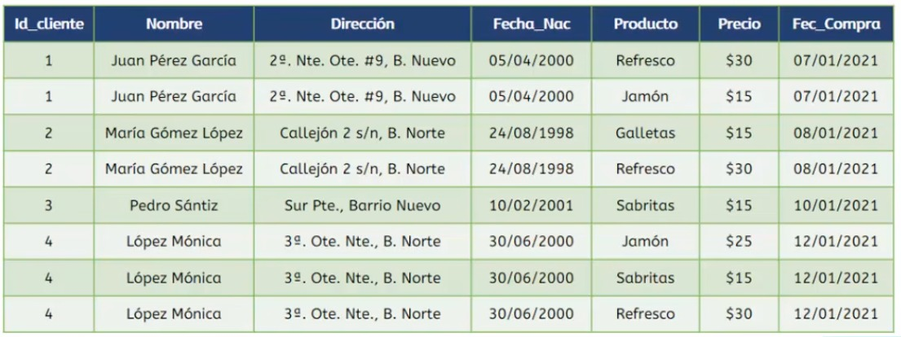
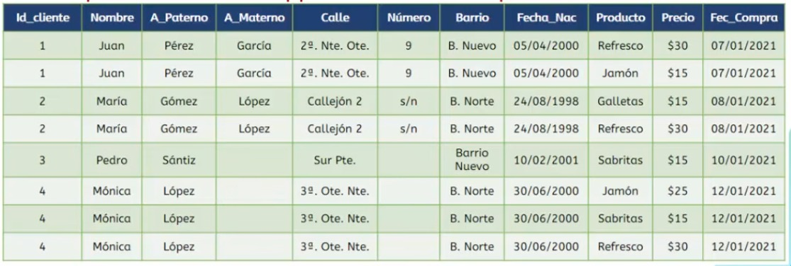
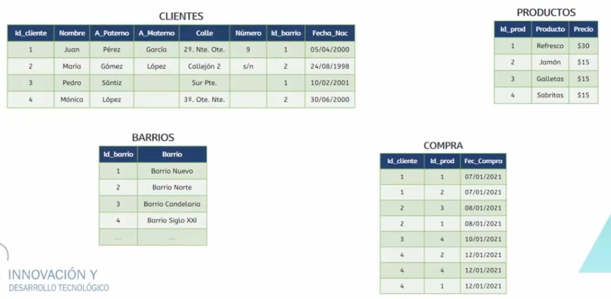

# Normalización de los datos

La normalización es un proceso de diseño de bases de datos relacionales cuyo objetivo es organizar los dfatos para reducir redundancia y evitar inconsistencias, es decir, es mantener cada hecho en un solo lugar para evitar redundancia y anomalías al insertar, actualizar o eliminar datos.

## Claves primarias y claves foraneas

Las tablas se relacionan con otras tablas mediante una relación de clave primaria o de clave foránea, además se utilizan para definir relaciones de muchos a uno entre tablas.

- **Claves primarias:** Es una columna o un conjunto de columnas en una tabla cuyos valores identifian de forma exclusiva una fila de la tabla. Una base de datos relacional está diseñada para imponer la exclusividad de las claves primarias permitiendo que haya sólo una fila con un valor de clave primaria específica en una tabla.
- **Claves foraneas:** Una clave foránea es una columna o conjunto de columnas en una tabla cuyos valores corresponden a los valores de la clave primaria de otra tabla. Para poder añadir una fila con un valor de calve foránea específico, debe existir una fila en la tabla relacionada 

## Primer forma normal (1FN)

La primer forma normal se cumple cuando:

- Las columnas y los valores almacenados en ellas, ya no se pueden dividir
- No deben existir valores repetidos en las columnas

**Ejemplo:**

  

Teniendo la primer tabla, se puede observar que primero podemos dividir el *nombre* por *nombre*, *apellido paterno* y *apellido materno*, además la *dirección* se puede dividir en *calle*, *número* y *barrio*, esto para cumplir con la primer regla de que los datos no se puedan dividir.

  

La nueva tabla tiene ahora separado el *nombre* por *nombre*, *apellido materno* y *apellido paterno*, además la *dirección* se separo por *calle*, *número* y *barrio*.  
Pero la tabla sigue sin cumplir completamente con la 1FN, ahora se tiene que dividir la tabla en partes ya que se puede dividir por *clientes*, *producto* y *compras*.

  

Se ha logrado dividir la tabla por *clientes*, productos con un *id* por cada producto, *compras* con un *id* por cada compra.
Pero la tabla *clientes* todavía cuenta con información repetida que es la columna de *barrio*, esta se tiene que dividir creando una nueva tabla llamada *barrios*.

  

Con esto la tabla incial se encuentra completamente en la primera forma normal.

## Segunda forma normal (2FN)

La segunda forma normal se cumple cuando:

- Estan las tablas cumpliendo la 1FN
- Todos los valores de las columnas deben depender únicamente de la llave primaria de la tabla
- Las tablas deben tener una única llave primaria que identifique a la tabla y que sus atributos dependen de ella

**Ejemplo:**

## Tercera forma normal (3FN)

La tercera forma normal se cumple cuando:

- Estan las tablas cumpliendo con la 2FN
- Los valores de las columnas de la tabla, no dependen de otras columnas que no sean la llave primaria

**Ejemplo**

