# SQL AVANZADO

## COMMON TABLE EXPRESSION (CTEs)

Herramienta de SQL que te permite crear un conjunto de resultados temporal dentor de una sola consulta, es decir, se define una tabla virtual o una variable con datos justo antes de ejecutar una consulta principal.

Las CTEs se definen utilizando la palabra clave `WITH`

**Ejemplo**

```sql
WITH <tabla_temporal> AS (
    -- subconsulta que genera los datos que queremos que sean temporales
    SELECT columna1, columna2, etc...
    FROM <tabla>
    WHERE <condicion>
)

-- consulta principal
SELECT *
FROM <tabla_temporal>
WHERE columna1 = 'valor';
```

** Ejemplo**

Determinar la fecha del primer episodio transmitido de cada serie.

```sql
WITH PrimerEpisodio AS (
    SELECT
        serie_id,
        MIN(fecha_estreno) AS fecha_primer_episodio
    FROM Episodios
    GROUP BY serie_id
)

SELECT
    s.titulo AS 'Titulo de la Serie',
    pe.fecha_primer_episodio AS 'Fecha del Primer Episodio'
FROM Series s
JOIN PrimerEpisodio pe
ON s.serie_id = pe.serie_id
ORDER BY pe.fecha_primer_episodio ASC;
```

<p align="center">
  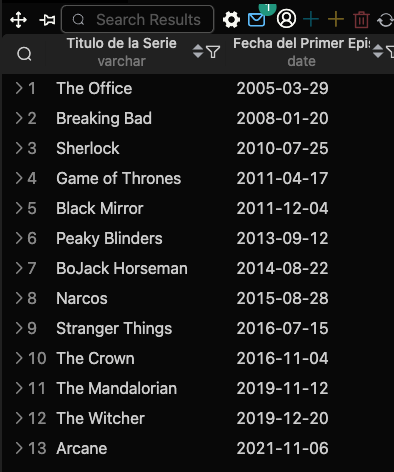
</p>

## WINDOW FUNCTION O FUNCIONES VENTANA

Son herramientas de SQL que permiten realizar cálculos analíticos avanzados sobre un conjunto de filas que están relacionadas con la fila actual.  
Son como un híbrido entre una consulta nomrla y un `GROUP BY`, es decir, con un `GROUP BY` las filas individuales se colapsan o se fusionan en un solo resultado, con una función ventana, puedes calcular totales, promedios o posiciones sin perder el detalle de cada fila. Cada registro sigue existiendo de forma independiente en el reporte.

La estructura esencial de cualquier función ventana se identifica porque utiliza obligatoriamente la cláusula `OVER`.

```sql
FUNC_NAME() OVER (
    [PARTITION BY columna_grupo]
    [ORDER BY columna_orden]
    [ROWS/RANGE especificación_de_marco]
)
```

donde:

- `PARTITION BY`: Divide las filas en grupos (zonas o ventanas), Si se omite, toda la tabla se trata como una única gran ventana
- `ORDER BY`: Define el orden en el que se procesan las filas dentro de cada ventana (vital para rankings o acumulados)
- `ROWS/RANGE`: Define el subgrupo dinámico dentro de la ventana, por ejemplo, calcular el promedio usando solo las 3 filas anteriores y la actual.

## PARTITION BY

Componente fundamental de las funciones de ventana (Window functions), la función principal es divirid o agrupar el conjuntto de datos en subgrupos o "ventanas" lógicas antes de que la función de ventanba realice su cálculo, es decir, `PARTITION BY` es el equivalente al `GROUP BY` pero para funciones de ventana. La gran diferencia es que, mientras `GROUP BY` colapsa tus filas y te devuelve una sola fila por cada grupo, `PARTITION BY` calcula el total, promedio o posición para cada grupo manteniendo intactas todas y cada una de las filas originales en el resultado.

¿Cómo funciona internamente?

Cuando pones `PARTITION BY` columna dentro de un `OVER()`, el motor de la base de datos hace lo siguiente:

- Toma todas las filas del resultado de tu consulta.
- Las separa en "islas" o carpetas independientes basadas en los valores de esa columna.
- Aplica la función (como `SUM`, `AVG`, `ROW_NUMBER`, etc.) de forma aislada dentro de cada carpeta.
- Cuando cambia de carpeta, el cálculo se reinicia de sde cero.

**Ejemplo**

```sql
SELECT
    serie_id,
    titulo,
    fecha_estreno,
    ROW_NUMBER() OVER (
        PARTITION BY serie_id
        ORDER BY fecha_estreno ASC
    ) AS numero_de_episodio
FROM Episodios;
```

<p align="center">
  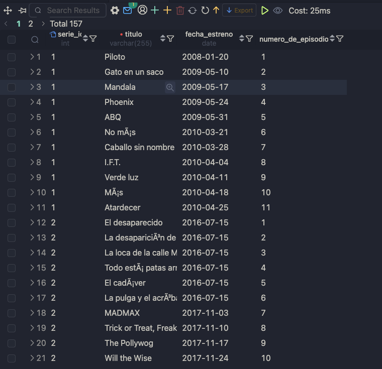
</p>

## **Lista de las funciones ventana**

Las funciones ventan se dividen en tres categorías según su objetivo analítico.

### Funciones de Clasificación o Ranking

Asignan un orden, puesto o posición numérica a cada fila dentro de su ventana basándose en un criterio.

- `ROW_NUMBER()`: Asigna un número entero secuencial único a cada fila, empezando en 1. Si hay empates, les asigna números diferentes de forma arbitraria.

**Ejemplo**

Númerar las series de cada serie en orden cronológico por su año de lanzamiento

```sql
SELECT
    serie_id,
    titulo,
    anio_lanzamiento,
    ROW_NUMBER() OVER (
        PARTITION BY serie_id
        ORDER BY anio_lanzamiento ASC
    ) AS numero_secuencial_episodio
FROM Series;
```

<p align="center">
  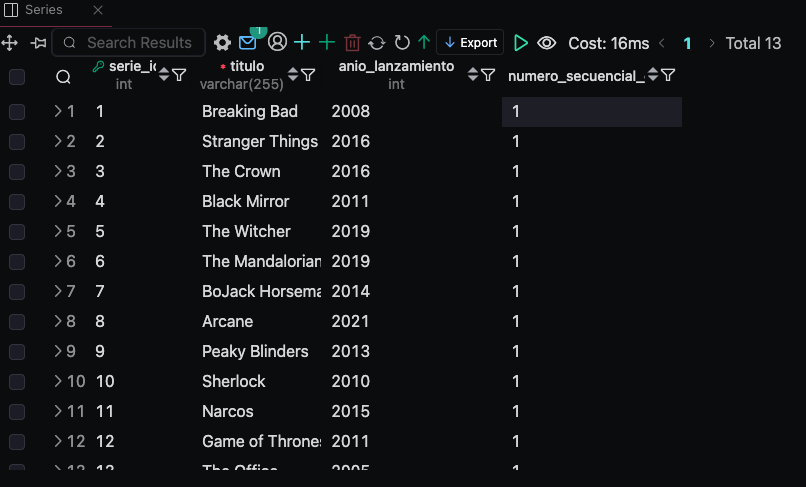
</p>

- `RANK()`: Asigna un rango, si hay empates en el orden, les asigna el mismo puesto, pero deja un hueco en la secuencia para los siguientes números.

**Ejemplo**

Crear un ranking de las series más antiguas. si dos series se lanzaron el mismo año, compartirán puesto, saltándose el siguiente.

```sql
SELECT
    titulo,
    anio_lanzamiento,
    RANK() OVER (ORDER BY anio_lanzamiento ASC) as ranking_antiguedad
FROM Series
```

<p align="center">
  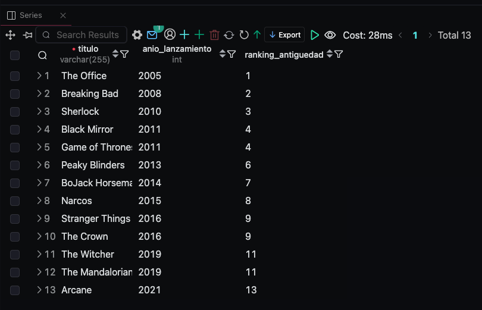
</p>

- `DENSE_RANK()`: La funcionalidad es la misma que `RANK()` pero no deja huecos en la numeración, el siguiente número es consecutivamente el que sigue.

**Ejemplo**

El mismo ranking de antigüedad anterior, pero manteniendo una numeración continua sin saltos.

```sql
SELECT
    titulo,
    anio_lanzamiento,
    DENSE_RANK() OVER (ORDER BY anio_lanzamiento ASC) AS rankin_continuo
FROM Series
```

<p align="center">
  
</p>

- `PERCENT_RANK()`: Cálcula el rango relativo de una fila expresado como un porcentaje entre 0 y 1 (es la posición relativa de la fila dentro del grupo)

**Ejemplo**

Ver en que percentil de antigüedad se sitúa cada serie dentro de su género

```sql
SELECT
    titulo,
    genero,
    anio_lanzamiento,
    PERCENT_RANK() OVER (
        PARTITION BY genero
        ORDER BY anio_lanzamiento ASC
    ) AS percentil_antiguedad
from Series;
```

<p align="center">
  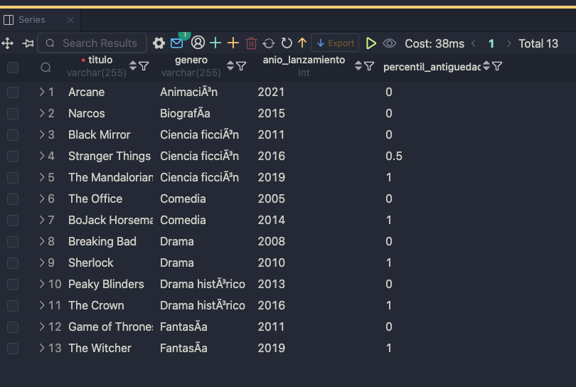
</p>

- `CUME_DIST()`: Cálcula la posición acumulada, devuelve la fracción de filas que son menores o iguales a la fila actual.

**Ejemplo**

Saber que porcentaje de episodios se lanzaron en o antes del año del episodio actual.

```sql
SELECT
    titulo,
    fecha_estreno,
    CUME_DIST() OVER (ORDER BY fecha_estreno ASC) AS distribucion_acumulada
FROM Episodios;
```

<p align="center">
  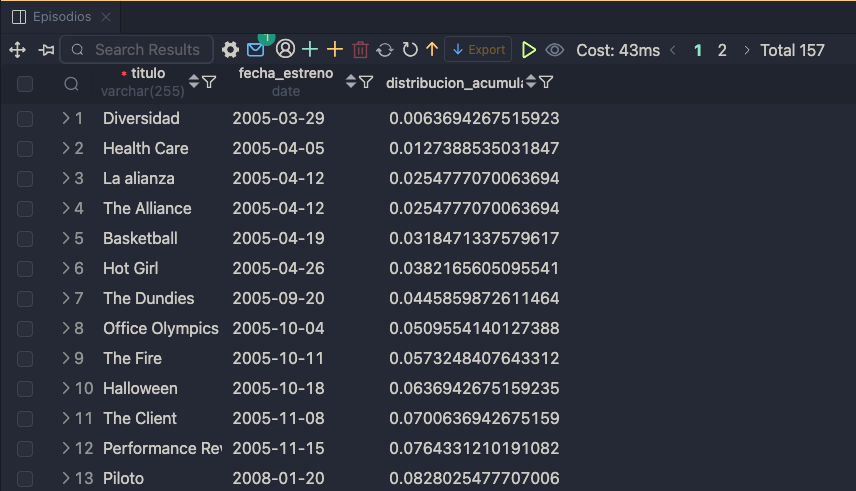
</p>

- `NTILE()`: Divide el resultado de la ventana en `n` grupos lo más equitativo posible y te dice a que número de grupo pertenece cada fila (ideal para cuartiles o tercios)

**Ejemplo**

Clasificar las series en 3 grupos iguales (Viejas, Medianas, Recientes) basándose en su año de lanzamiento

```sql
SELECT
    titulo,
    anio_lanzamiento,
    NTILE(3) OVER (ORDER BY anio_lanzamiento ASC) as tercio_antiguedad
FROM Series;
```

<p align="center">
  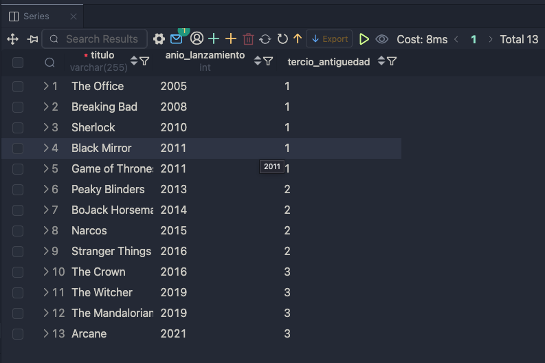
</p>

### Funciones de Valor o Analíticas

- `LAG()`: Accede al valor de una fila anterior a la actual sin necesidad de hacer un `JOIN`.

**Ejemplo**

Comparar el año de lanzamiento de un episodio con el año del episodio inmediatamente anterior de la misma serie.

```sql
SELECT
    serie_id,
    titulo,
    fecha_estreno,
    LAG(fecha_estreno, 1, NULL) OVER(
        PARTITION BY serie_id
        ORDER BY fecha_estreno ASC
    ) AS anio_episodio_anterior
FROM Episodios;
```

<p align="center">
  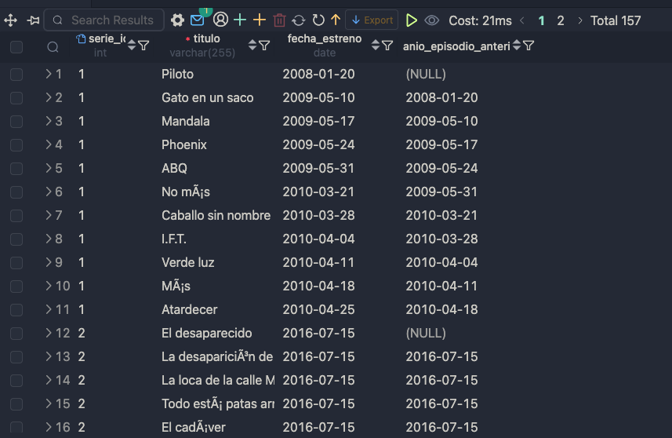
</p>

- `LEAD()`: Accede al valor de una fila posterior (siguiente) a la actual

**Ejemplo**

Proyectar cuál es el título del siguiente episodio que se lanzó de la misma serie.

```sql
SELECT
    serie_id,
    titulo,
    LEAD(titulo,1, 'Ultimo lanzado') OVER (
        PARTITION BY serie_id
        ORDER BY fecha_estreno ASC
    ) AS siguiente_episodio
FROM Episodios;
```

<p align="center">
  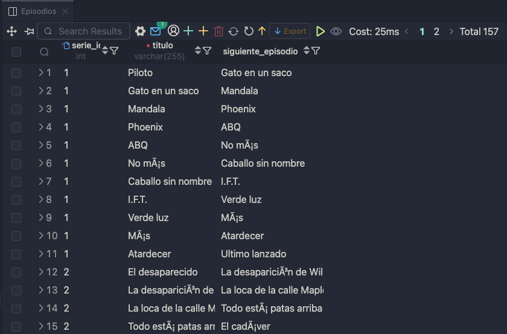
</p>

- `FIRST_VALUE()`: Devuelve el primer valor del conjunto de la ventana según el orden establecido

**Ejemplo**

Al listar los episodios, mostrar siempre cuál fue el primer episodio lanzado de esa serie para comparar.

```sql
SELECT
    serie_id,
    titulo,
    fecha_estreno,
    FIRST_VALUE(titulo) OVER (
        PARTITION BY serie_id
        ORDER BY fecha_estreno ASC
    ) AS primer_episodio_serie
FROM Episodios
```

<p align="center">
  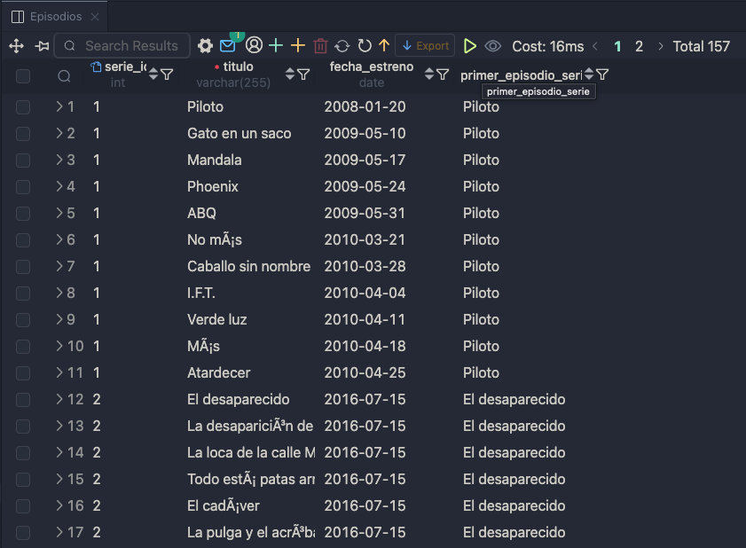
</p>

- `LAS VALUE`: Devuelve el último valor del conjunto de la ventana. Se requiere ajustar el marco ROWS parta que no se detenga en la fila actual.

**Ejemplo**

Mostrar junto a cada episodio cuál es el último episodio lanzado hasta la fecha en la serie

```sql
SELECT
    serie_id,
    titulo,
    fecha_estreno,
    LAST_VALUE(titulo) OVER (
        PARTITION BY serie_id
        ORDER BY fecha_estreno ASC
        ROWS BETWEEN UNBOUNDED PRECEDING and UNBOUNDED FOLLOWING
    ) AS ultimo_episodio_serie
FROM Episodios
```

<p align="center">
  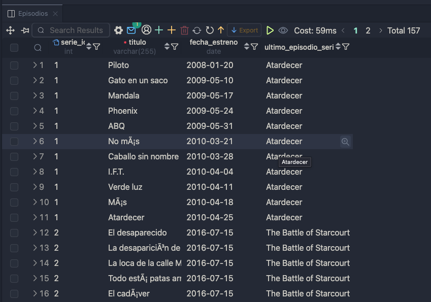
</p>

- `NTH_VALUE()`: Devuelve el valor de la fila que ocupa la posición exacta `n` dentro de la ventana.

**Ejemplo**

Obtener el título del segundo episodio lanzado de cada serie para analizar patrones de retención

### Funciones de Agregación como Ventana

- `SUM()`: Realiza una suma acumulada fila por fila

**Ejemplo**

Contar de forma acumulativa cuántos episodios se van estrenando año tras año globalmente en la plataforma

- `AVG()`: Cálcula el promedio del grupo o una media jmóvil sin agrupar las filas

**Ejemplo**

Mostrar el año de lanzamiento promedio de la series de un género específico junto a cada serie individual

- `COUNT()`: Cuenta registros dinámicamente en la ventana

**Ejemplo**

Mostrar junto a cada serie cuántas series existen en total dentor de su mismo género

- `MIN()`: Identifica el valor mínimo de la ventana

**Ejemplo**

Mostrar junto a cada serie el año de la serie más vieja de su mismo género

- `MAX()`: Identifica el valor máximo de la ventana

**Ejemplo**

Mostrar junto a cada serie el año de la serie más reciente de su mismo género
